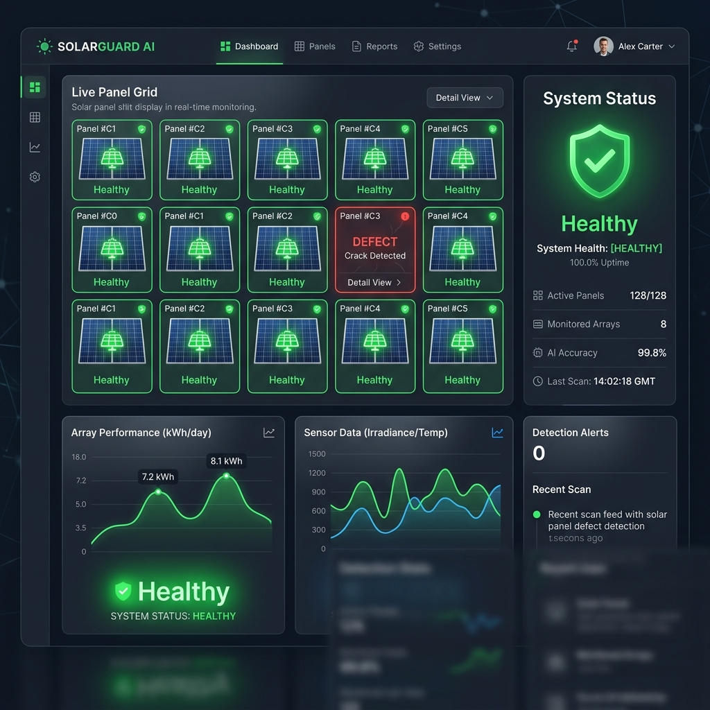
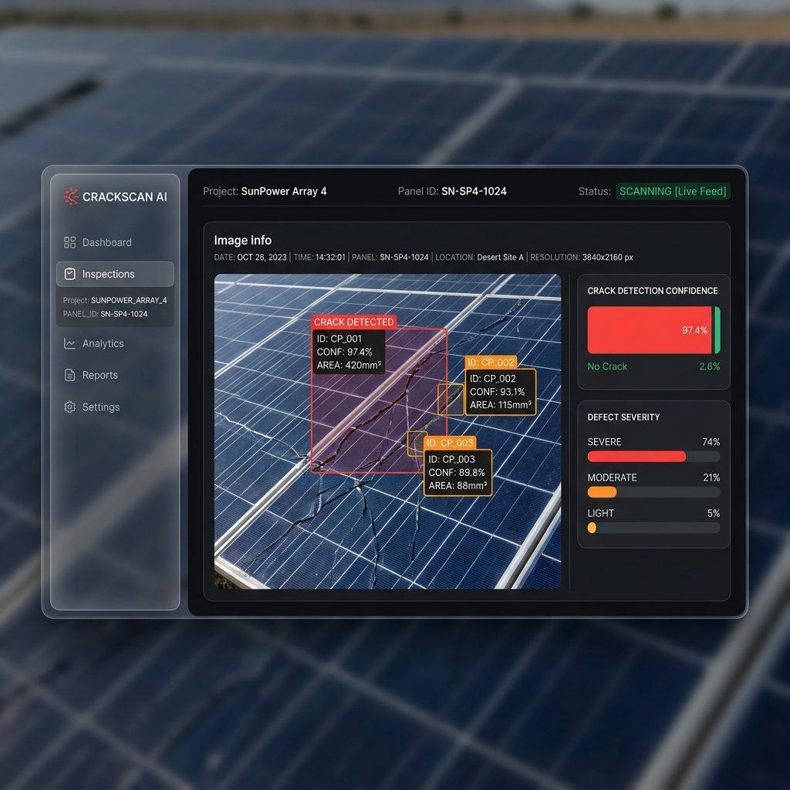

<div align="center">
  
</div>

<h1 align="center">SolarGuard AI ☀️🔍</h1>

<p align="center">
  <b>An enterprise-grade, AI-powered defect detection system for solar arrays.</b><br/>
  Features real-time computer vision inference, automated dataset management, and a dynamic telemetry dashboard.
</p>

<p align="center">
  
  
  
</p>

SolarGuard AI is an end-to-end Computer Vision pipeline for photovoltaic anomaly detection. It automates the detection of critical hardware defects (cracks, dust, hotspots, delamination) using advanced deep learning models, allowing solar farms to minimize maintenance downtime and maximize energy output.

## 📸 Platform Interface

<div align="center">
  
</div>

## ✨ Key Features

- **Real-Time Inference Engine:** Instantly analyze solar panel imagery using MobileNetV2, EfficientNetB0, or ResNet50 architectures.
- **Dynamic Telemetry Dashboard:** Monitor array health, critical anomalies, and inspection histories in real-time.
- **Model Laboratory:** Track hyperparameter tuning, validate class distributions, and run automated ML experiments.
- **Dataset Repository:** Manage training data, oversee data augmentation impacts, and monitor live ingestion.
- **Enterprise-Grade UI:** A stunning, glassmorphism-inspired React/Vite interface powered by Tailwind CSS and Framer Motion.

## 🛠️ Tech Stack

### Frontend Architecture
- **React.js & Vite:** Extremely fast, modern UI rendering.
- **Tailwind CSS & Framer Motion:** Beautiful styling and micro-animations.
- **Lucide React & Recharts:** High-quality icons and dynamic data visualization.

### Backend & AI Pipeline
- **FastAPI (Python):** High-performance asynchronous API framework.
- **TensorFlow / Keras:** Deep learning inference engine for Computer Vision.
- **Motor (Asyncio):** Non-blocking MongoDB database driver.
- **MongoDB Atlas:** Cloud-hosted NoSQL database for telemetry storage.

## 🚀 Quick Start (Development)

### 1. Clone the repository
```bash
git clone https://github.com/PJain7988/SolarGuard-AI.git
cd SolarGuard-AI
```

### 2. Backend Setup
Navigate to the backend directory, install dependencies, and run the FastAPI server:
```bash
cd backend
python -m venv venv
source venv/Scripts/activate  # On Windows
pip install -r requirements.txt

# Ensure your MongoDB URI is set in your environment
python -m uvicorn app.main:app --host 0.0.0.0 --port 8000 --reload
```

### 3. Frontend Setup
Navigate to the frontend directory, install node modules, and start the Vite dev server:
```bash
cd frontend
npm install
npm run dev
```

The application will be available at `http://localhost:5173`.

## 🌐 Production Deployment
- **Frontend:** Deployed via Vercel Edge Network.
- **Backend:** Deployed via Render (Automated via `render.yaml` Blueprint).
- **Database:** Hosted globally on MongoDB Atlas.

## 🔒 Security & Access
This evaluation deployment operates with simulated RBAC and SSO. For production deployments, AES-256 encryption and zero-trust architectures should be explicitly configured within the environment variables.

---
*Built with ❤️ by the SolarGuard AI Engineering Team.*
